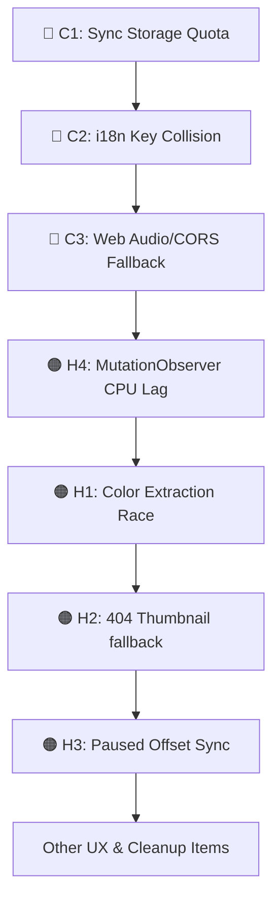

# StreamLyrics Chrome Extension — Codebase Bug & Issue Report

**Project:** StreamLyrics Chrome Extension (v1.0.0)  
**Stack:** React 18 + TypeScript + Vite + CRXJS, Manifest V3  
**Audit Date:** May 28, 2026  
**Auditor:** Antigravity AI  

---

## 📑 Table of Contents

1. [Executive Summary](#-executive-summary)
2. [Summary Table of Active Bugs](#-summary-table-of-active-bugs)
3. [🔴 Critical & High-Severity Bugs](#-critical--high-severity-bugs)
4. [🟠 Medium-Severity Bugs](#-medium-severity-bugs)
5. [🟡 Performance & Code Quality Issues](#-performance--code-quality-issues)
6. [🟢 UX & Glitches](#-ux--glitches)
7. [✅ Suggested Action & Fix Order](#-suggested-action--fix-order)

---

## 📋 Executive Summary

A comprehensive architectural and code audit has been performed on the **StreamLyrics** extension codebase. The extension uses a modern stack comprising React, Vite, and CRXJS to inject a draggable, resizable overlay on YouTube and YouTube Music.

While the core functionality and sync loop are solid, the codebase contains several **critical bugs**, **performance footguns**, **storage quota violations**, and **internationalization edge-cases** that will cause failure or severe lag under common real-world conditions.

### Top Concerns:
1. **Chrome Storage Sync Quota Crash:** Sliders trigger sync storage writes on every pixel drag, immediately violating Chrome's tight 120 writes/min limit.
2. **i18n Key Collision:** Non-Latin song titles (Japanese, Hindi, Cyrillic, etc.) collapse into the identical key `lyrics__` in storage, overwriting cached lyrics.
3. **Web Audio / CORS Muting Risk:** Direct connection of cross-origin CDN media streams to the audio context without `crossorigin="anonymous"` can completely silence the player.
4. **Infinite CPU Overhead:** Global `MutationObserver` on `document.body` queries selectors in a loop without any debouncing or throttling.
5. **Locked Out Race Conditions:** Rapid song switching leaves the dominant color extractor locked onto default or stale colors.

---

## 📊 Summary Table of Active Bugs

| Severity | ID | Component / File | Description | Impact Area |
| :---: | :--- | :--- | :--- | :--- |
| 🔴 | **C1** | `src/popup/popup.js` | `chrome.storage.sync` Write Quota Exceeded on Sliders | Preference Storage / Stability |
| 🔴 | **C2** | `src/content/services/storageService.ts` | Storage Key Collisions for Non-Latin Scripts | Lyrics Cache Persistence |
| 🔴 | **C3** | `src/content/hooks/useAudioBars.ts` | Web Audio / CORS Silencing & Lack of Procedural Fallback | Visualizer & Player Audio |
| 🟠 | **H1** | `src/content/hooks/useDominantColor.ts` | Color Extraction Race Condition Lockout | Visual Aesthetics / Dynamic UI |
| 🟠 | **H2** | `src/content/utils/colorExtractor.ts` | Missing Max-Resolution YouTube Thumbnail Fallbacks | Visual Aesthetics / 404 Failure |
| 🟠 | **H3** | `src/content/hooks/useVideoSync.ts` | Active Line Recalculation Skip on Offset Adjust when Paused | Sync Adjustment UX |
| 🟠 | **H4** | `src/content/hooks/useVideoSync.ts` | Massive CPU Overhead from Global `MutationObserver` | Performance / Device Battery |
| 🟡 | **M1** | `src/content/components/Panel.tsx` | Instrumental Gap Logic and Positional Scrolling Bug | Lyrics Scroller UI / UX |
| 🟡 | **M2** | `src/content/utils/transcriptParser.ts` | Over-Aggressive Artist Name Sanitization | Track Information Matching |
| 🟡 | **M3** | `src/content/hooks/useSettings.ts` | Missing storage `areaName` Filter on Settings Changes | State Isolation |

---

## 🔴 Critical & High-Severity Bugs

### 🔴 C1. `chrome.storage.sync` Write Quota Exceeded on Preference Sliders
* **Location:** `src/popup/popup.js` (lines 74–87)
* **Problem:**
  The sliders for Panel Width and Font Size register `'input'` event listeners:
  ```javascript
  if (panelWidthSlider && widthValue) {
      panelWidthSlider.addEventListener('input', (e) => {
          const value = parseInt(e.target.value, 10);
          widthValue.textContent = `${value}px`;
          saveSettings({ panelWidth: value }); // Fired on every pixel!
      });
  }
  ```
  Every pixel of movement results in a synchronous call to `chrome.storage.sync.set(...)`.
* **Impact:**
  Chrome enforces a strict write quota on the `sync` storage namespace: **120 writes per minute** and **1800 writes per hour**. Dragging a slider for just two seconds triggers dozens of writes, exceeding the quota. Chrome throws a runtime exception, blocks further settings saves, and crashes preference syncing.
* **Recommended Fix:**
  Change the listener event to `'change'` (triggers only on mouse-release) or implement a debounce function (e.g., 250ms delay) for the storage write, while maintaining the `'input'` event solely for the local DOM label update.

---

### 🔴 C2. Local Storage Key Collisions for Non-Latin (i18n) Song Scripts
* **Location:** `src/content/services/storageService.ts` (lines 24–28)
* **Problem:**
  The storage key generation uses an overly restrictive ASCII-only regex sanitizer:
  ```typescript
  function getStorageKey(artist: string, title: string): string {
      const safeArtist = artist.toLowerCase().replace(/[^a-z0-9]/g, '');
      const safeTitle = title.toLowerCase().replace(/[^a-z0-9]/g, '');
      return `${STORAGE_PREFIX}${safeArtist}_${safeTitle}`;
  }
  ```
* **Impact:**
  For tracks written in non-Latin scripts (Japanese, Cyrillic, Hindi, Korean, Chinese, Arabic, etc.), the title and artist resolve to completely empty strings. For instance:
  - Artist `米津玄師` + Title `打上花火` -> `lyrics__`
  - Artist `澤野弘之` + Title `λ` -> `lyrics__`
  
  All non-Latin songs share the identical key `lyrics__` in `chrome.storage.local`, continuously overwriting each other and destroying local lyrics persistence.
* **Recommended Fix:**
  Replace the sanitization with a URL-safe encoding scheme (`encodeURIComponent`) or create a hash (e.g., FNV-1a or SHA-1) of the lowercase artist and title:
  ```typescript
  function getStorageKey(artist: string, title: string): string {
      const hashInput = `${artist.trim().toLowerCase()}|${title.trim().toLowerCase()}`;
      // Use FNV-1a or simple hash to make a clean alphanumeric key
      let hash = 2166136261;
      for (let i = 0; i < hashInput.length; i++) {
          hash ^= hashInput.charCodeAt(i);
          hash += (hash << 1) + (hash << 4) + (hash << 7) + (hash << 8) + (hash << 24);
      }
      return `${STORAGE_PREFIX}${(hash >>> 0).toString(16)}`;
  }
  ```

---

### 🔴 C3. Web Audio / CORS Silencing & Lack of Procedural Visualizer Fallback
* **Location:** `src/content/hooks/useAudioBars.ts` (lines 94–118)
* **Problem:**
  The extension hooks into the active video element to feed the visualizer:
  ```typescript
  const source = audioCtx.createMediaElementSource(mediaEl);
  source.connect(newAnalyser);
  newAnalyser.connect(audioCtx.destination);
  ```
* **Impact:**
  In modern browsers, connecting a cross-origin media element (such as YouTube's `<video>` tag playing streams from Google's video CDN domains) to a Web Audio API graph silences the audio completely unless the video has `crossorigin="anonymous"` and the server responds with CORS headers. Since YouTube does not configure `crossorigin`, this block **silences the video completely** for users or fails silently.
  
  Furthermore, the `try-catch` block catches graph construction failures, but does not spin up any procedural visualization. If initialization fails, the loop bails out, leaving a completely static visualizer.
* **Recommended Fix:**
  Add a fallback mechanism that generates mock wave visualizer bars when the audio context fails or when no signal is detected, and avoid routing active player audio through the analyser if it results in playback mute.

---

## 🟠 Medium-Severity Bugs

### 🟠 H1. Dominant Color Extraction Lockout Race Condition
* **Location:** `src/content/hooks/useDominantColor.ts` (lines 22–24)
* **Problem:**
  The hook uses a simple boolean `extractingRef.current` lock to prevent overlapping image requests:
  ```typescript
  const extractColor = async (url: string) => {
      if (url === lastThumbnailRef.current || extractingRef.current) {
          return; // Discared completely!
      }
      extractingRef.current = true;
      ...
  ```
* **Impact:**
  If a user quickly skips songs, the `thumbnailUrl` updates while the previous color extraction is still running (`extractingRef.current` is `true`). The new thumbnail request is **silently discarded**. Once the active promise finishes, `extractingRef` resets to `false`, but the visualizer remains locked onto the previous track's color palette indefinitely.
* **Recommended Fix:**
  Track the active request URL using a local variable or ref in `useEffect` and compare inside the promise resolution. Discard outdated promise resolutions instead of locking out new requests:
  ```typescript
  useEffect(() => {
      let active = true;
      const extract = async () => {
          const color = await extractDominantColor(thumbnailUrl);
          if (active) setColor(color);
      };
      extract();
      return () => { active = false; };
  }, [thumbnailUrl]);
  ```

---

### 🟠 H2. Missing YouTube SD Thumbnail Fallback (404 Error)
* **Location:** `src/content/utils/colorExtractor.ts` (lines 152–154)
* **Problem:**
  The thumbnail retriever assumes `maxresdefault.jpg` is always available:
  ```typescript
  export function getThumbnailUrl(videoId: string): string {
      return `https://img.youtube.com/vi/${videoId}/maxresdefault.jpg`;
  }
  ```
* **Impact:**
  YouTube only generates the `maxresdefault` thumbnail for HD videos (720p+). Standard definition, older, or vintage music videos return `404 Not Found`. When this occurs, `loadImage` fails, and the color extractor falls back to the generic solid red color `#8B3A3A`, ruining the adaptive design.
* **Recommended Fix:**
  Modify the image loader to attempt `maxresdefault.jpg` first, and on load failure (`onerror`), automatically swap the source to the guaranteed `hqdefault.jpg` thumbnail:
  ```typescript
  function loadImage(url: string, fallbackUrl?: string): Promise<HTMLImageElement> {
      return new Promise((resolve, reject) => {
          const img = new Image();
          img.crossOrigin = 'anonymous';
          img.onload = () => resolve(img);
          img.onerror = () => {
              if (fallbackUrl) {
                  img.src = fallbackUrl;
                  fallbackUrl = undefined;
              } else {
                  reject(new Error(`Failed to load image`));
              }
          };
          img.src = url;
      });
  }
  ```

---

### 🟠 H3. Active Line Highlight Skip on Offset Adjust when Paused
* **Location:** `src/content/hooks/useVideoSync.ts` (lines 84–90)
* **Problem:**
  The synchronization RAF loop skips calculating the current line index if the video is paused:
  ```typescript
  if (!video.paused) {
      const newIndex = findCurrentLineIndex(time);
      if (newIndex !== lastLineIndexRef.current) {
          lastLineIndexRef.current = newIndex;
          setCurrentLineIndex(newIndex);
      }
  }
  ```
* **Impact:**
  When a song is paused and the user clicks the offset buttons to adjust sync (+0.5s / -0.5s), the offset updates in state, but the **lyrics highlight is not re-evaluated**. The highlight remains stuck on the old line until the user resumes video playback, leading to frustrating sync correction UX.
* **Recommended Fix:**
  Trigger a manual line recalculation inside the `adjustOffset` and `resetOffset` callbacks so the highlighted line updates immediately when paused.

---

### 🟠 H4. Severe CPU Overhead from Unthrottled Global `MutationObserver`
* **Location:** `src/content/hooks/useVideoSync.ts` (lines 176–180)
* **Problem:**
  The hook observes mutations on `document.body` to find the video element:
  ```typescript
  const observer = new MutationObserver(() => {
      findVideo();
  });
  observer.observe(document.body, { childList: true, subtree: true });
  ```
* **Impact:**
  `findVideo()` performs `document.querySelectorAll` over 6 distinct selectors. YouTube pages undergo hundreds of DOM mutations per minute during media updates, player controls, and recommendations. Invoking non-debounced DOM query selectors on *every single mutation* is an enormous CPU drain, leading to frame drops and sluggish browser performance on mid-to-low-tier devices.
* **Recommended Fix:**
  Debounce the MutationObserver callback with a simple 300ms timer, or throttle the execution of `findVideo` so it runs at most once every 500ms during DOM mutation periods.

---

## 🟡 Performance & Code Quality Issues

### 🟡 M1. Positional Scrolling and Early Display Glitch for Instrumental Breaks
* **Location:** `src/content/components/Panel.tsx` (lines 600–617, 1079–1081)
* **Problem 1 (Logic):**
  The mid-song instrumental calculation only checks the gap between current and next lines:
  ```typescript
  return (
      !!nextLine &&
      nextLine.start - currentLine.start - currentLine.duration > INSTRUMENTAL_GAP_THRESHOLD
  );
  ```
  It returns `true` for the **entire** active period of `currentLine`, even if `currentTime` is still actively inside `currentLine`'s duration (meaning the singer is currently singing).
* **Problem 2 (UX):**
  The instrumental break element is appended to the absolute bottom of the scroller container:
  ```tsx
  <div ref={scrollRef} className="streamlyrics-scroll-container">
      {lines.map((line, index) => (...))}
      {isInstrumental() && (
          <div className="instrumental-break">{'\u266a'} Instrumental {'\u266a'}</div>
      )}
  </div>
  ```
* **Impact:**
  1. The "Instrumental Break" indicator flashes onto the screen while the singer is still active on the current line.
  2. The indicator is physically placed at the bottom of the lyrics container. Unless the song has ended or the user manually scrolls down, it remains hidden below the fold.
* **Recommended Fix:**
  - Update `isInstrumental` to verify `currentTime + offset > currentLine.start + currentLine.duration` (only show the break indicator *after* the current lyric ends).
  - Place the instrumental indicator in the middle of the viewport or as a floating centered overlay rather than appending it to the scroll container's footer.

---

### 🟡 M2. Over-Aggressive Artist Name Sanitization
* **Location:** `src/content/utils/transcriptParser.ts` (lines 303–312)
* **Problem:**
  `cleanArtistText` replaces standard words commonly found in artist names:
  ```typescript
  function cleanArtistText(value: string): string {
      return value
          .replace(/\s+-\s+Topic$/i, '')
          .replace(/\b\d+(\.\d+)?[KMB]?\s+(views?|subscribers?)\b/gi, '')
          .replace(/\b(song|video|official|album|single)\b/gi, '') // Too aggressive!
          ...
  ```
* **Impact:**
  Legitimate bands containing words like "Album", "Single", "Official", or "Video" are corrupted:
  - `"The Album Leaf"` -> `"The Leaf"`
  - `"Official HIGE DANdism"` -> `"HIGE DANdism"`
  - `"Video Age"` -> `"Age"`
  - `"Single Mothers"` -> `"Mothers"`
  This breaks downstream lyrics lookups (e.g., on LRCLIB), resulting in "no lyrics found" for these artists.
* **Recommended Fix:**
  Restrict stripping these decorators to title cleaning only, or remove the word-stripping regex entirely from the `cleanArtistText` pipeline.

---

### 🟡 M3. Missing Storage Area Filtering in `useSettings`
* **Location:** `src/content/hooks/useSettings.ts` (lines 74–84)
* **Problem:**
  The `onChanged` listener captures all changes indiscriminately:
  ```typescript
  const handleStorageChange = (changes: { [key: string]: chrome.storage.StorageChange }) => {
      const newSettings: Partial<Settings> = {};
      if (changes.enabled) newSettings.enabled = changes.enabled.newValue;
      if (changes.panelWidth) newSettings.panelWidth = changes.panelWidth.newValue;
      if (changes.fontSize) newSettings.fontSize = changes.fontSize.newValue;
      ...
  ```
* **Impact:**
  `chrome.storage.onChanged` fires on changes across *both* `local` and `sync` storage. If local state updates (e.g. storage of lyrics or panel placement) using keys named `enabled`, `panelWidth`, or `fontSize`, it will override the user's active settings incorrectly.
* **Recommended Fix:**
  Add a filter for the `sync` storage namespace:
  ```typescript
  chrome.storage.onChanged.addListener((changes, areaName) => {
      if (areaName !== 'sync') return;
      ...
  });
  ```

---

## 🟢 UX & Glitches

### 🟢 G1. `confirm()` and Brutal Page Reload for Lyrics Deletion
* **Location:** `src/content/components/Panel.tsx` (lines 432–434)
* **Problem:**
  When deleting local lyrics, the panel issues a browser-native `confirm()` pop-up and then does a full page reload:
  ```typescript
  if (!confirm(`Delete saved lyrics for "${track}" by ${artist}?`)) return;
  await storageService.deleteLyrics(artist, track);
  window.location.reload();
  ```
* **Impact:**
  A native `confirm` halts the browser thread. A full page reload is a heavy UX disruption (resets video playback progress, triggers advertisements, re-buffers media stream).
* **Recommended Fix:**
  Replace `confirm` with a custom floating modal styled inside the Shadow DOM, and trigger `refetch()` or clear the state on deletion instead of refreshing the entire tab.

---

## ✅ Suggested Action & Fix Order

To quickly restore stability, performance, and internationalization support, it is recommended to apply fixes in the following order:



1. **Phase 1 (Critical Preference Save):** Debounce `popup.js` slider writes (Fix **C1**).
2. **Phase 2 (Global Usability & Persist):** Implement hash-based storage keys (Fix **C2**).
3. **Phase 3 (Visualizer & Playback Stability):** Protect `MediaElementSource` connection to prevent audio muting (Fix **C3**).
4. **Phase 4 (Performance Optimization):** Debounce the `MutationObserver` (Fix **H4**).
5. **Phase 5 (Aesthetics & UX):** Clean up the thumbnail fallback (Fix **H2**), color lockout (Fix **H1**), and paused offset recalculations (Fix **H3**).
